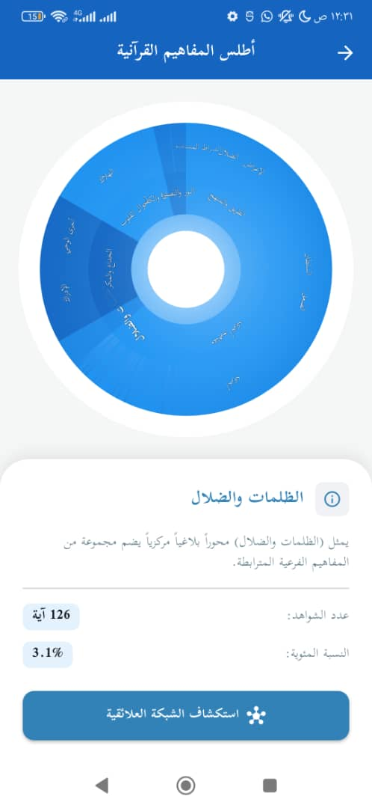
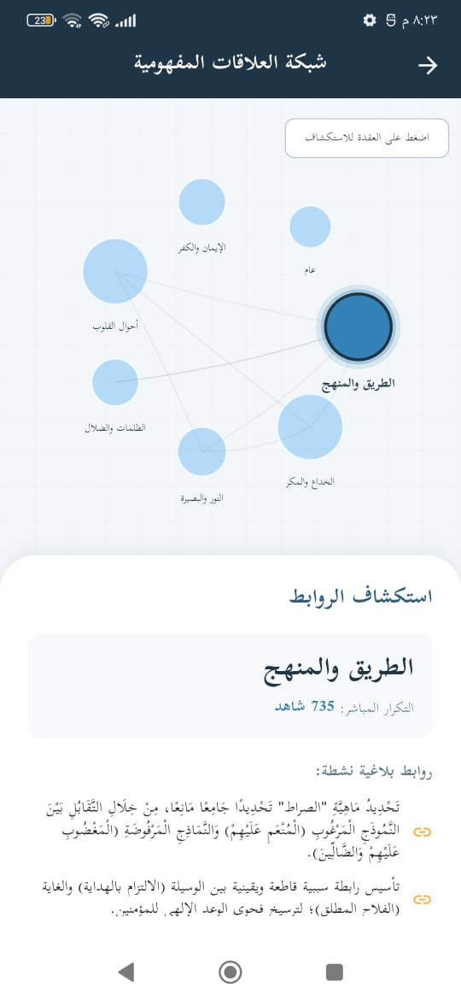
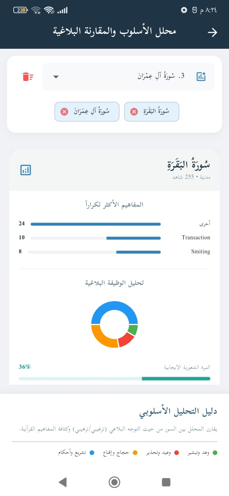
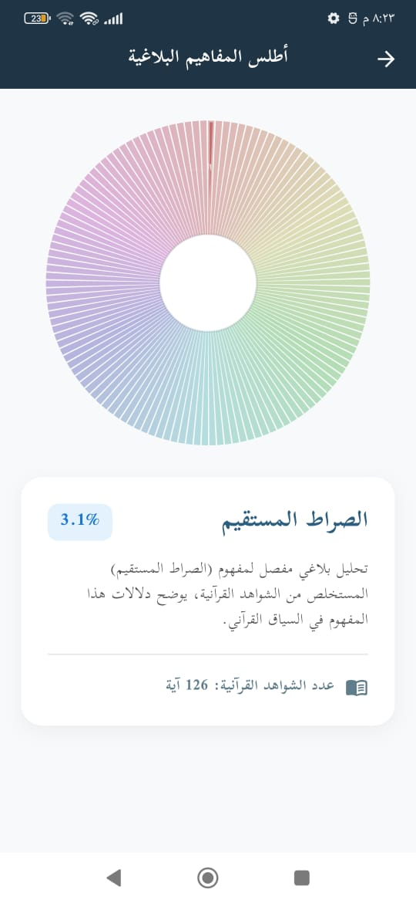
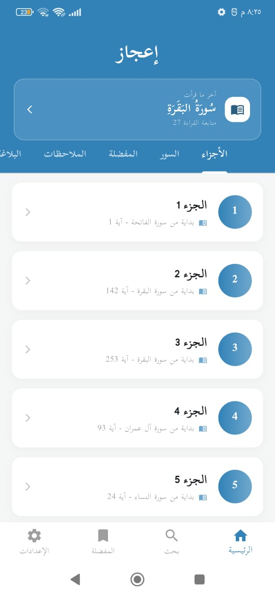
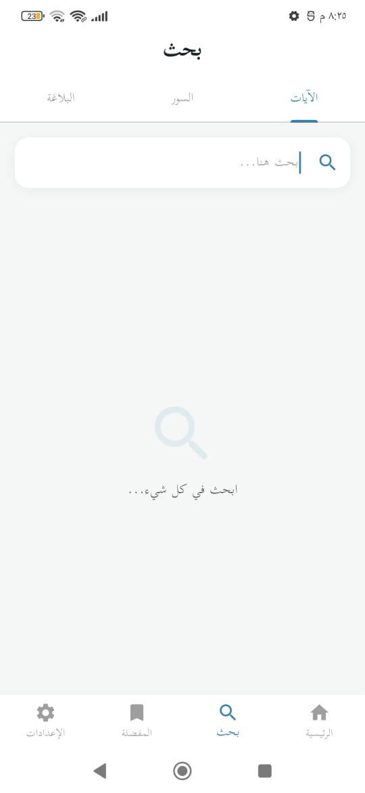
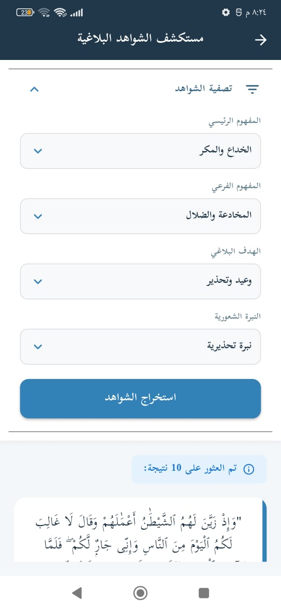
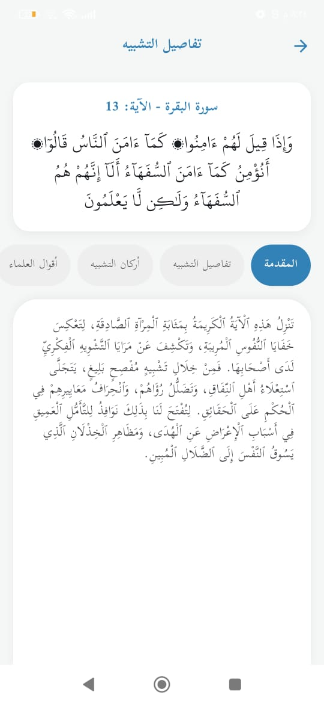
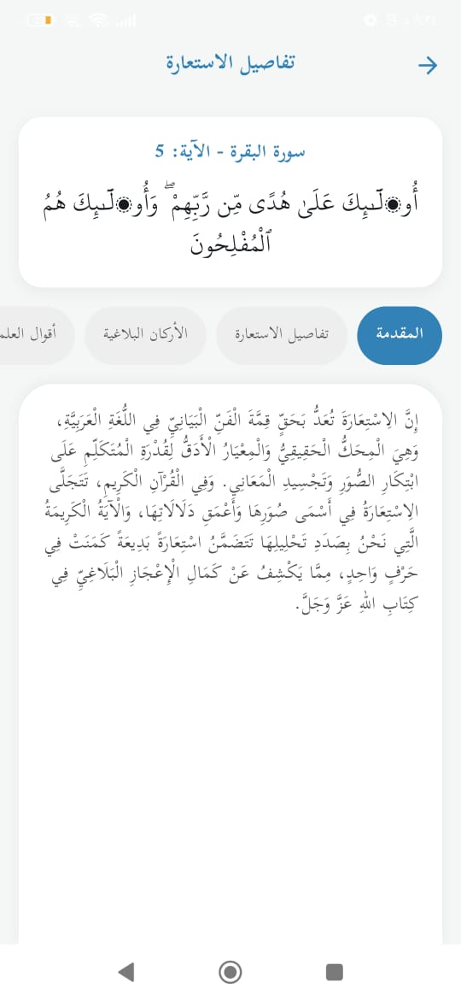

# <p align="center">🌙 تطبيق إعجاز (Ijaaz App)</p>
## <p align="center">منصة تحليل البيان والجماليات القرآنية</p>

<p align="center">
  
  
  
</p>

---

### 🌟 نبذة عن المشروع (About)
تطبيق **إعجاز** هو مشروع رائد يهدف إلى تقريب علوم البلاغة والبيان القرآني لعامة المسلمين والباحثين باستخدام أحدث تقنيات تحليل البيانات والتمثيل البصري. لا يكتفي التطبيق بعرض النص، بل يغوص في "العلاقات المفهومية" و"الوظائف البلاغية" لكل آية.

---

### 📸 معرض الصور (Visual Showcase)

#### 1️⃣ التحليل الهيكلي والبصري
| أطلس المفاهيم (Sunburst) | شبكة العلاقات (Graph) | محلل الأسلوب والمقارنة |
|:---:|:---:|:---:|
|  <br> (قرآني) |  |  |
|  <br> (بلاغي) | | |

#### 2️⃣ رحلة المستخدم والبحث
| الواجهة الرئيسية | البحث الشامل | مستكشف الشواهد |
|:---:|:---:|:---:|
|  |  |  |

#### 3️⃣ التفاصيل البيانية (Rhetorical Details)
| تفاصيل التشبيه | تفاصيل الاستعارة |
|:---:|:---:|
|  |  |

---

### ✨ المميزات الرئيسية (Core Features)

#### 📊 أدوات التحليل البياني (Data Visualization)
*   **أطلس المفاهيم التفاعلي**: استكشاف توزيع المفاهيم القرآنية عبر مخططات Sunburst المتداخلة.
*   **محلل الأسلوب المقارن**: أداة فريدة للمقارنة بين السور من حيث (الوعد، الوعيد، الحجاج، التشريع) مع قياس النبرة الشعورية.
*   **خرائط المفاهيم الذكية**: تمثيل العلاقات بين المواضيع القرآنية كشبكة مترابطة (Graph Theory).

#### 🔍 الاستكشاف والتدبر (Exploration)
*   **محرك بحث بلاغي**: ابحث عن "التشبيه في سورة البقرة" أو "آيات الترغيب" بضغطة زر.
*   **شرح أكاديمي مفصل**: لكل شاهد بلاغي (توضيح أركان التشبيه، نوع الاستعارة، وأقوال الأقدمين).

#### 🛠 التخصيص والأدوات الشخصية (Personalization)
*   **نظام العلامات المرجعية**: حفظ الآيات والشواهد للعودة إليها لاحقاً.
*   **سجل الملاحظات التدبرية**: مساحة خاصة للمستخدم لتدوين خواطره حول الآيات.
*   **دعم القارئ والتجويد**: واجهة قراءة مريحة مع ميزات التجويد البصري.

---

### 🧬 المنهجية العلمية (Methodology)
يعتمد التطبيق على قاعدة بيانات ضخمة مصنفة علمياً:
1.  **Tagging**: تصنيف كل آية حسب المفهوم الرئيسي والفرعي.
2.  **Rhetorical Function**: تحديد الوظيفة البلاغية (وعد، وعيد، إقناع، إلخ).
3.  **Visual Mapping**: تحويل هذه البيانات إلى قيم رقمية تظهر في الرسوم البيانية.

---

### 🚀 التشغيل التقني (Technical Setup)
```bash
# Clone project
git clone https://github.com/ameen39/ijaaz_app.git

# Install dependencies
flutter pub get

# Generate Localization (if needed)
flutter gen-l10n

# Run the app
flutter run
```

---

### 🛠 التقنيات (Tech Stack)
*   **Framework**: Flutter (Cross-platform)
*   **Data Viz**: FL Chart & Custom Graphs
*   **Localization**: Flutter Intl (AR/EN support)
*   **Architecture**: Provider/State Management with Clean Layouts

---

### 🤝 المساهمة (Contribution)
نسعد بجميع المساهمات التي تهدف إلى تحسين جودة البيانات أو الميزات التقنية. يرجى فتح Issue قبل إرسال Pull Request.

---

**ملاحظة للمطورين:** جميع الصور موجودة في مجلد `screenshots` بلاحقة ملفات من نوع `.jpeg` (تأكد من كتابتها كاملة .jpeg وليس .jpg لتعمل الروابط بشكل صحيح).

---

<p align="center">تم التطوير بكل ❤️ لخدمة كتاب الله</p>
